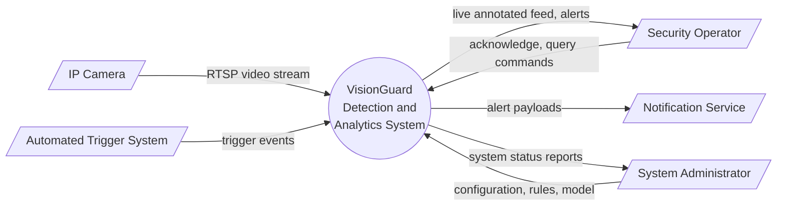
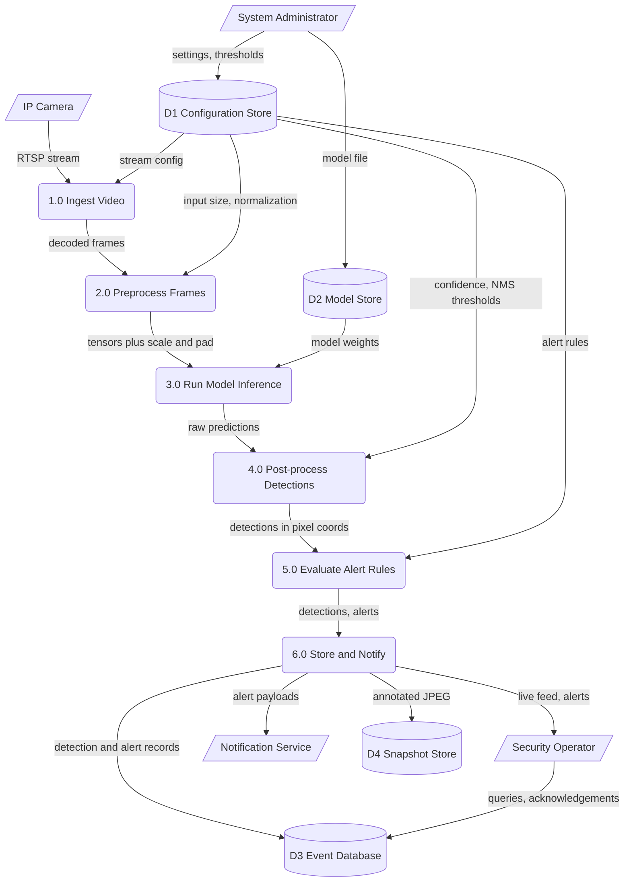
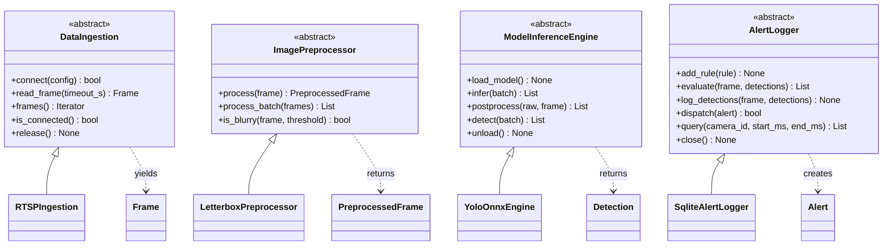

# System Design Specification

**Course:** AI Project Design and Development, Air University Islamabad
**Lab:** 02, System Requirements and Software Architecture for AI Projects
**Author:** Zubair Khalil
**Student ID:** 231204
**Version:** 1.0

This document covers two related systems. Section 2 specifies a Smart Automated Attendance System (Task 1). Sections 3 to 6 specify an AI surveillance and object detection platform, referred to as **VisionGuard** (Tasks 2 to 4). Both rely on the same camera to inference to logging pipeline, so the module design in Section 6 serves either one.

## Table of Contents

1. Overview
2. Functional and Non-Functional Requirements
3. System Boundary, Actors and Input/Output Mapping
4. Data-Flow Diagrams
5. Operational Constraints
6. Modular Software Architecture
7. Repository Layout
8. Traceability Matrix

---

## 1. Overview

VisionGuard ingests live video from IP cameras, detects objects of interest (people, vehicles, restricted items), evaluates alert rules, and stores events for later review. The design goal is a pipeline of small, independent modules so that the detector, the camera source or the alert channel can be swapped without touching the rest.

| Item | Value |
|---|---|
| Primary language | Python 3.10+ |
| Core libraries | OpenCV, NumPy, ONNX Runtime (or PyTorch), SQLite |
| Deployment target | Edge device (Jetson class) or a single GPU workstation |
| Input | RTSP H.264 streams, video files |
| Output | Bounding boxes, alerts, log records, snapshots |

---

## 2. Functional and Non-Functional Requirements

Case study: **Smart Automated Attendance System.** A camera at a classroom door recognizes enrolled students, marks them present and syncs the record to a central server.

### 2.1 Functional Requirements

| ID | Requirement | Acceptance Criterion |
|---|---|---|
| FR-01 | Face detection: the system shall detect all frontal faces in each processed frame. | Detection runs in 100 ms or less per frame on the target device. |
| FR-02 | Face recognition: the system shall match each detected face against enrolled student embeddings. | Match returned with a similarity score; faces below 0.60 are labeled "unknown". |
| FR-03 | Attendance logging: the system shall record a student's first confirmed appearance per class session. | One record per student per session, with student ID, timestamp and camera ID. No duplicates. |
| FR-04 | Database synchronization: the system shall push local records to the central database. | Records sync within 60 seconds of capture when online, and queue locally while offline. |
| FR-05 | Enrollment management: an administrator shall be able to add, update and remove student profiles. | Changes take effect without restarting the service. |

### 2.2 Non-Functional Requirements

| ID | Category | Requirement | Target |
|---|---|---|---|
| NFR-01 | Performance | Minimum processing frame rate | 10 FPS or higher per camera |
| NFR-02 | Accuracy | Recognition accuracy on the enrolled set | 95% or higher true accept rate at 1% false accept rate |
| NFR-03 | Power | Edge device power draw during continuous operation | 15 W or less (for example Jetson Orin Nano in 15 W mode) |
| NFR-04 | Privacy | Face embeddings encrypted at rest (AES-256), raw video not retained beyond 24 hours, access logged | Verified by configuration audit |
| NFR-05 | Availability | Automatic recovery from camera disconnects and process crashes | Resume within 30 seconds, uptime 99% during class hours |

---

## 3. System Boundary, Actors and Input/Output Mapping

### 3.1 Actors

| Actor | Type | Role | Interaction |
|---|---|---|---|
| Security Operator | Human, primary | Watches live detections and responds to alerts | Views dashboard, acknowledges or dismisses alerts |
| System Administrator | Human, primary | Configures cameras, rules, thresholds and users | Edits configuration, manages models and retention |
| Automated Trigger System | External system | Fires events such as door sensors or motion detectors that raise processing priority | Sends trigger messages to the system |
| IP Camera | External device | Supplies the video stream | Pushes RTSP video |
| Notification Service | External system | Delivers alerts by email, SMS or push | Receives alert payloads |

### 3.2 System Inputs

| Input | Format | Specification |
|---|---|---|
| Video stream | RTSP over TCP, H.264 | 1920x1080 or 1280x720, 15 to 30 FPS, 2 to 4 Mbps per camera |
| Sensor parameters | JSON message | Sensor ID, event type, timestamp, zone ID |
| System configuration | YAML file | Camera URIs, rule definitions, confidence and NMS thresholds |
| Model artifact | ONNX file | Single detector with a fixed input size of 640x640 |
| Operator commands | REST API call | Acknowledge alert, change threshold, start or stop a camera |

### 3.3 System Outputs

| Output | Format | Specification |
|---|---|---|
| Bounding boxes | JSON | `label`, `class_id`, `confidence`, `bbox_xyxy` in original frame pixels, optional `track_id` |
| Alert notification | JSON over HTTPS, email, SMS | Alert ID, camera, time, rule name, severity, snapshot link |
| Log entries | SQLite rows plus text log | One row per detection, one per alert, plus system health records |
| Snapshots | JPEG | Frame at alert time with boxes drawn, quality 85 |
| Dashboard feed | MJPEG or WebSocket | Annotated live view for the operator |

### 3.4 Boundary Statement

Inside the boundary: ingestion, preprocessing, inference, post-processing, alert rules, local storage, the operator API. Outside the boundary: the cameras, the network, the notification providers, the central university database, and the physical sensors.

---

## 4. Data-Flow Diagrams

Diagrams use Mermaid and render directly on GitHub. Notation: rectangles are external entities, rounded boxes are processes, cylinders are data stores, arrows are data flows.

### 4.1 Level 0 (Context Diagram)



### 4.2 Level 1 (Decomposition)



### 4.3 Process Descriptions

| Process | Input | Output | Module |
|---|---|---|---|
| 1.0 Ingest Video | RTSP stream, stream config | Decoded `Frame` objects | `DataIngestion` |
| 2.0 Preprocess Frames | `Frame` | `PreprocessedFrame` | `ImagePreprocessor` |
| 3.0 Run Model Inference | `PreprocessedFrame`, weights | Raw prediction arrays | `ModelInferenceEngine.infer` |
| 4.0 Post-process Detections | Raw predictions | `Detection` list | `ModelInferenceEngine.postprocess` |
| 5.0 Evaluate Alert Rules | `Detection` list, rules | `Alert` list | `AlertLogger.evaluate` |
| 6.0 Store and Notify | Detections, alerts | DB rows, snapshots, notifications | `AlertLogger.dispatch` |

---

## 5. Operational Constraints

| Constraint | Limit | Rationale |
|---|---|---|
| Maximum memory footprint | 2 GB RAM and 1.5 GB GPU memory for the full pipeline | Fits a 4 GB edge device with room for the OS |
| Bandwidth per camera | 4 Mbps inbound; total uplink to the cloud under 2 Mbps | Shared campus network, only alerts and snapshots leave the site |
| End-to-end latency | 250 ms or less from capture to alert | Operator needs near real-time response |
| Inference latency | 60 ms or less per frame | Needed for 15 FPS on a single stream |
| Frame queue | 4 frames per camera, oldest dropped when full | Prevents delay buildup under load |
| Storage | 50 GB local; snapshots kept 30 days, detection logs 90 days | Edge disk size |
| Network loss | Alerts queue locally and retry with exponential backoff | Network is not guaranteed |
| Operating temperature | Up to 45 C ambient with passive cooling | Cabinet installation |
| Security | TLS for all external traffic, API token authentication | Protects video and identity data |

---

## 6. Modular Software Architecture

### 6.1 Design Principles

Each module hides its implementation behind an abstract base class, takes typed inputs and returns typed outputs from `vision_types.py`, and never imports another module's internals. A thin `pipeline.py` wires them together. This keeps every module testable with mock inputs.

### 6.2 Module Overview

| Module | Responsibility | Depends on |
|---|---|---|
| `DataIngestion` | Connect to sources, reconnect on failure, decode and yield frames | `vision_types` |
| `ImagePreprocessor` | Resize with letterbox, color convert, normalize, quality gate | `vision_types` |
| `ModelInferenceEngine` | Load model, run inference, apply confidence filter and NMS, remap boxes | `vision_types` |
| `AlertLogger` | Apply alert rules with debounce and cooldown, persist events, notify | `vision_types` |

### 6.3 Shared Types (`src/vision_types.py`)

| Class | Fields |
|---|---|
| `Frame` | `camera_id: str`, `frame_id: int`, `timestamp_ms: int`, `image: np.ndarray` |
| `PreprocessedFrame` | `source: Frame`, `tensor: np.ndarray`, `scale: (float, float)`, `pad: (int, int)` |
| `Detection` | `label: str`, `class_id: int`, `confidence: float`, `bbox_xyxy: (int, int, int, int)`, `track_id: Optional[int]` |
| `Alert` | `alert_id`, `camera_id`, `timestamp_ms`, `severity: Severity`, `rule_name`, `detections`, `snapshot_path`, `extra` |
| `Severity` | Enum: `INFO`, `WARNING`, `CRITICAL` |

The file is named `vision_types.py` on purpose. A file called `types.py` would shadow Python's standard library module of the same name.

### 6.4 DataIngestion (`src/data_ingestion.py`)

| Method | Inputs | Returns | Description |
|---|---|---|---|
| `connect` | `config: StreamConfig` | `bool` | Opens the stream with retry and backoff |
| `read_frame` | `timeout_s: float` | `Optional[Frame]` | Next frame or `None` on timeout |
| `frames` | none | `Iterator[Frame]` | Generator for the main loop |
| `is_connected` | none | `bool` | Stream health check |
| `release` | none | `None` | Frees the capture handle |

Concrete class: `RTSPIngestion`. Configuration: `StreamConfig(camera_id, uri, target_fps, reconnect_attempts, reconnect_backoff_s, buffer_size)`.

### 6.5 ImagePreprocessor (`src/image_preprocessor.py`)

| Method | Inputs | Returns | Description |
|---|---|---|---|
| `process` | `frame: Frame` | `PreprocessedFrame` | Letterbox resize, BGR to RGB, normalize, HWC to NCHW |
| `process_batch` | `frames: List[Frame]` | `List[PreprocessedFrame]` | Batch version, order preserved |
| `is_blurry` | `frame: Frame`, `threshold: float` | `bool` | Laplacian variance quality gate |

Concrete class: `LetterboxPreprocessor`. Configuration: `PreprocessConfig(input_size, mean, std, letterbox, bgr_to_rgb)`.

### 6.6 ModelInferenceEngine (`src/model_inference_engine.py`)

| Method | Inputs | Returns | Description |
|---|---|---|---|
| `load_model` | none | `None` | Loads weights and runs a warm-up pass |
| `infer` | `batch: List[PreprocessedFrame]` | `List[np.ndarray]` | Raw network output per frame |
| `postprocess` | `raw: np.ndarray`, `frame: PreprocessedFrame` | `List[Detection]` | Threshold, NMS, remap to original pixels |
| `detect` | `batch: List[PreprocessedFrame]` | `List[List[Detection]]` | `infer` plus `postprocess` |
| `unload` | none | `None` | Releases memory |

Concrete class: `YoloOnnxEngine`. Configuration: `InferenceConfig(model_path, device, conf_threshold, iou_threshold, max_detections, class_names)`.

### 6.7 AlertLogger (`src/alert_logger.py`)

| Method | Inputs | Returns | Description |
|---|---|---|---|
| `add_rule` | `rule: AlertRule` | `None` | Registers a rule |
| `evaluate` | `frame: Frame`, `detections: List[Detection]` | `List[Alert]` | Applies rules with debounce and cooldown |
| `log_detections` | `frame: Frame`, `detections: List[Detection]` | `None` | Writes every detection to the event store |
| `dispatch` | `alert: Alert` | `bool` | Saves snapshot, stores alert, notifies channels |
| `query` | `camera_id: Optional[str]`, `start_ms: int`, `end_ms: int` | `List[Alert]` | Time window lookup |
| `close` | none | `None` | Flushes and closes the database |

Concrete class: `SqliteAlertLogger`. Rule definition: `AlertRule(name, target_labels, min_confidence, min_consecutive_frames, cooldown_s, severity)`. Notification channels implement the `NotificationChannel` protocol with a single `send(alert) -> bool` method.

### 6.8 Pipeline Wiring (reference)

```python
def run(ingest, pre, engine, logger):
    engine.load_model()
    for frame in ingest.frames():
        if pre.is_blurry(frame):
            continue
        tensor = pre.process(frame)
        detections = engine.detect([tensor])[0]
        logger.log_detections(frame, detections)
        for alert in logger.evaluate(frame, detections):
            logger.dispatch(alert)
```

### 6.9 Class Relationship Diagram



---

## 7. Repository Layout

```
project-root/
|-- ARCHITECTURE.md
|-- src/
|   |-- vision_types.py
|   |-- data_ingestion.py
|   |-- image_preprocessor.py
|   |-- model_inference_engine.py
|   `-- alert_logger.py
`-- tests/
```

---

## 8. Traceability Matrix

| Requirement | Satisfied by |
|---|---|
| FR-01 face detection latency | `ModelInferenceEngine.detect`, constraint of 60 ms inference |
| FR-02 recognition threshold | `InferenceConfig.conf_threshold`, `postprocess` |
| FR-03 attendance logging | `AlertLogger.log_detections`, `AlertRule.cooldown_s` for deduplication |
| FR-04 database sync | `AlertLogger.dispatch` with local queue and retry |
| FR-05 enrollment management | Configuration store D1, administrator API |
| NFR-01 frame rate | `StreamConfig.target_fps`, frame queue limit |
| NFR-02 accuracy | Model selection and threshold tuning, validated offline |
| NFR-03 power | Edge device power mode, batch size of 1 |
| NFR-04 privacy | Encrypted store D3, retention limits in Section 5 |
| NFR-05 availability | `DataIngestion.connect` retry, `is_connected` health check |
